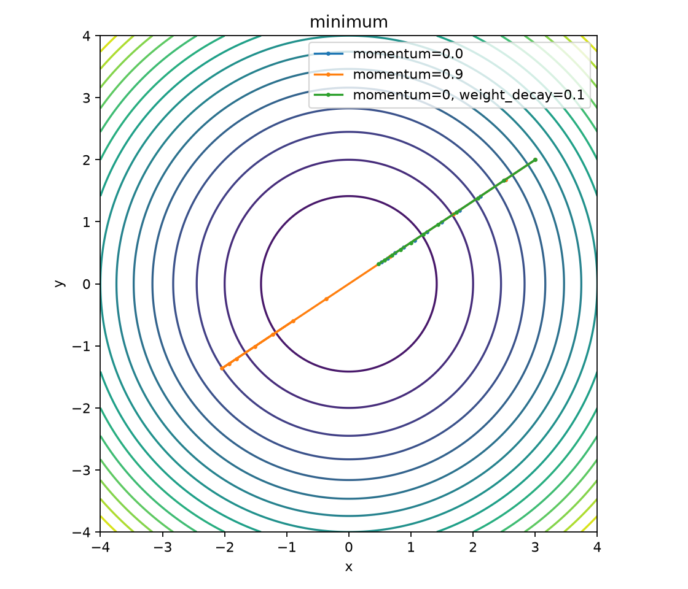
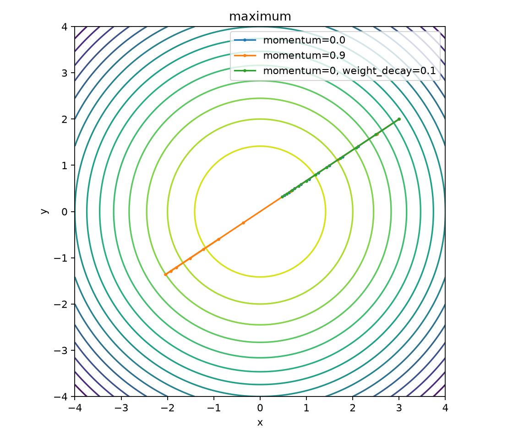
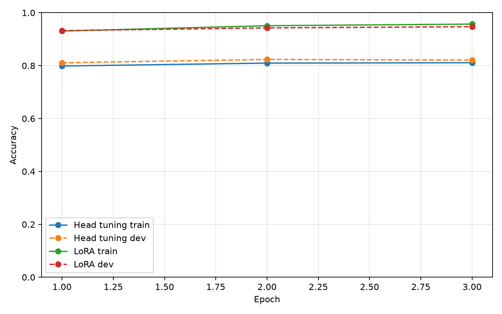

# CSE 5539 Homework

This document organizes the answers and experiments requested by `homework.pdf`.
The code and generated artifacts live in this repository so that empirical claims
can be reproduced.  Github Repo: [wzqvip/CSE5539-SP-topic-in-LLM](https://github.com/wzqvip/CSE5539-SP-topic-in-LLM)


## 1. Transformer architecture

For a batch of hidden-state matrices $X \in \mathbb{R}^{B \times L \times d}$,

$$
Q=XW^Q,\qquad K=XW^K,\qquad V=XW^V,
$$

and one attention head is

$$
\operatorname{head}(X)=\operatorname{softmax}\left(\frac{QK^T}{\sqrt{d_k}}+M\right)V.
$$

Multi-head attention concatenates $h$ heads and projects them:

$$
\operatorname{MHA}(X)=\operatorname{Concat}(\operatorname{head}_1,\ldots,\operatorname{head}_h)W^O.
$$

$W^Q,W^K,W^V$ learn queries, keys, and values; $W^O$ mixes heads; $d_k$
controls scaling; and $M$ is an optional mask. Batch matrix multiplication
keeps the leading batch dimension, so the same equations process $B$ examples.

## 2. Language models

### 2.1 Perplexity

Document perplexity is at least $1$, achieved when every next-token prediction
has probability $1$ on the observed token. 

There is no finite maximum: as any
observed token's probability approaches $0$, its negative log probability and
therefore perplexity approach infinity. A finite vocabulary does not prevent
this because a model may assign arbitrarily small positive probability to the
observed token.

### 2.2 Sampling

1. Temperature $0$ is the greedy limit: choose the highest-probability token.
1. Temperature $1$ samples from the model distribution without rescaling it.
1. Temperature above $1$ flattens the distribution, increasing diversity and
   also the chance of incoherent continuations.
1. Nucleus sampling samples from the smallest set whose cumulative mass is at
   least $p$, adapting the candidate set to the context.
1. Top-$k$ sampling samples from the $k$ highest-probability tokens. It is simple
   to control but uses a fixed candidate count for every context.

### 2.3 Reproducible experiment

```powershell
python run_lm_experiments.py --output-dir runs/language-model
```

This writes `results.json` and `samples.md`. The original paragraph should
have lower perplexity than its word-shuffled version because local word order
contains information learned by the language model. Greedy output is usually
the least diverse; increasing temperature generally increases diversity while
eventually reducing coherence. The generated text is stored as the experiment
record instead of being hand-copied into the report.

The verified CPU run produced perplexities of `134.80` for the original and
`1781.77` for the shuffled paragraph. Each requested continuation uses 150 new
tokens; the complete outputs are in [samples.md](runs/language-model/samples.md).

| Text               | Perplexity |
| ------------------ | ---------: |
| Original paragraph |     134.80 |
| Shuffled paragraph |    1781.77 |

Sampling outputs from the verified run:

| Temperature | Qualitative observation                                  |
| ----------: | -------------------------------------------------------- |
|           0 | Deterministic, but repeats the same phrase extensively.  |
|         0.3 | More varied than greedy, but still repetitive.           |
|         0.6 | Some coherent prose with repeated dialogue.              |
|         0.9 | More diverse and less repetitive, with weaker coherence. |
|         1.2 | Highly diverse but increasingly noisy and fragmented.    |
|         1.5 | Very diverse, with substantial nonsensical text.         |

The full 150-token outputs, including the exact generated text for every
temperature, are included in [samples.md](runs/language-model/samples.md).

## 3. Optimization

### 3.1 Maximization versus minimization

For minimization, SGD updates $\theta \leftarrow \theta-\eta g$; for
maximization, it uses $\theta \leftarrow \theta+\eta g$. PyTorch's
`maximize=True` changes this sign internally, so the same gradient points toward
increasing rather than decreasing the objective.

### 3.2 SGD experiment

```powershell
python visualize_sgd.py --output-dir runs/sgd
```

The script produces one contour plot for $f(x,y)=x^2+y^2$ and one for
$f(x,y)=-x^2-y^2$, plus `trajectories.json`. Momentum can overshoot and create
longer curved paths before settling. Weight decay adds a pull toward the origin;
for minimization it reinforces the optimum, while for maximization it competes
with movement away from the origin. The checked-in run is in `runs/sgd/`.



*Figure 1. SGD trajectories for minimizing $x^2+y^2$.*



*Figure 2. SGD trajectories for maximizing $-x^2-y^2$.*

## 4. Fine-tuning ModernBERT on SST-2

The implementation is in `train_modernbert.py`. Head tuning freezes the
backbone and trains only the classifier. LoRA freezes pretrained weights, adds
low-rank updates to attention/MLP projections, and keeps the classifier
trainable. Both modes select the highest validation-accuracy checkpoint before
reporting test accuracy. SST-2's public test labels may be unavailable, in
which case the test value is recorded as `null` rather than guessed.

Smoke-test command:

```powershell
python train_modernbert.py --mode both --epochs 1 --max-train-samples 128 --max-eval-samples 128 --output-dir runs/smoke
```

The checked-in smoke run is a pipeline check: head validation accuracy is
`0.5000` and LoRA validation accuracy is `0.5625`. The final fixed-seed CUDA
run is in `runs/modernbert-sst2/` and uses the RTX 5060. Head tuning reached
`0.8234` validation accuracy at epoch 2; LoRA reached `0.9472` at epoch 3.
The trainable parameter counts were `592130` for head tuning and `212738` for
LoRA. The public SST-2 test split had no usable labels, so test accuracy is
recorded as `null`.

### 4.3 Results

| Approach    | Trainable parameters | Best epoch | Best validation accuracy |   Test accuracy |
| ----------- | -------------------: | ---------: | -----------------------: | --------------: |
| Head tuning |              592,130 |          2 |                   0.8234 | N/A (unlabeled) |
| LoRA        |              212,738 |          3 |                   0.9472 | N/A (unlabeled) |

Validation accuracy by epoch:

| Epoch | Head train | Head validation | LoRA train | LoRA validation |
| ----: | ---------: | --------------: | ---------: | --------------: |
|     1 |     0.7986 |          0.8108 |     0.9308 |          0.9323 |
|     2 |     0.8096 |          0.8234 |     0.9509 |          0.9427 |
|     3 |     0.8111 |          0.8211 |     0.9570 |          0.9472 |



*Figure 3. Training and validation accuracy for head tuning and LoRA on SST-2.*

LoRA improves validation accuracy by 12.38 percentage points over head tuning
while using about 35.9% as many trainable parameters. The head model peaks at
epoch 2 and slightly overfits afterward; LoRA continues improving through epoch
3. This comparison uses the same fixed seed (`5539`) and the same RTX 5060 CUDA
run, but the result is still a single-seed experiment rather than a confidence
interval across repeated runs.

## 5. Efficient Transformer inference

Prefill processes the whole prompt in parallel and builds the key/value cache.
Decode generates one token at a time; causal attention for the new token reads
cached keys and values from previous positions. Decode is inefficient because
generation is sequential and cannot parallelize future tokens. Continuous
batching, speculative decoding, and optimized kernels are practical ways to
improve throughput or latency.

In standard multi-head attention, each layer stores one key and one value vector
for every prior token, so cache size grows linearly with sequence length.
Grouped or multi-query attention shares K/V heads, reducing memory and bandwidth
at the cost of less independent attention capacity and sometimes a small quality
loss.

## Sources and disclosure

The main reference is Vaswani et al., *Attention Is All You Need*:
https://arxiv.org/abs/1706.03762.

### AI assistance disclosure 

ChatGPT was used to assist with the project documentation, fix coding problems,  and organization of results. 

I reviewed the generated material, developed and ran the experiments locally on RTX5060, and verified the reported results before including them in this document.
